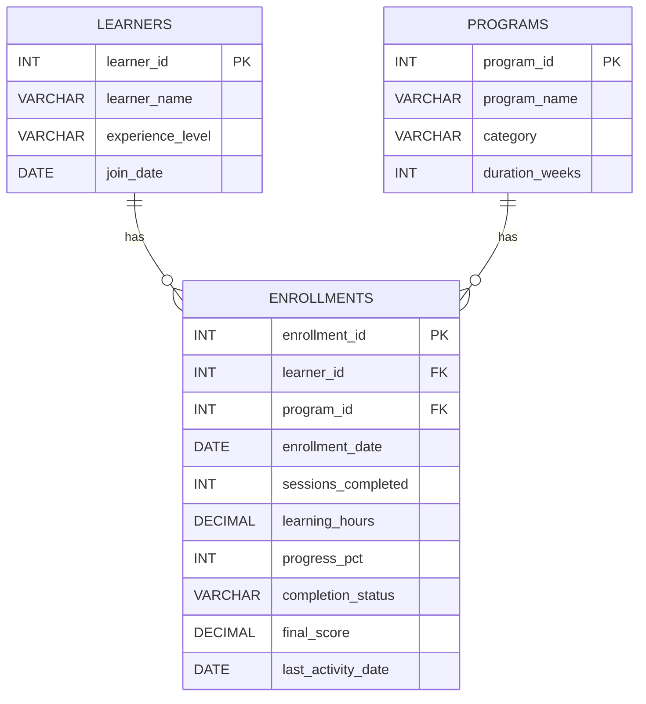

# LearnAI – SQL Business Analysis

## 1. Project Overview

**LearnAI** is an AI-powered learning platform designed to help professionals build new skills.

The number of learners joining the platform is increasing, but LearnAI is not sure whether this growth is translating into meaningful learning outcomes. Some learners remain active and make steady progress, while others lose interest. Different programs also show different levels of participation and completion.

This project uses **SQL and a dummy dataset** to investigate learner behaviour, program performance, engagement, completion and learning outcomes.

---

## 2. Business Problem

The analysis focuses on:

1. Are learners remaining active after joining?
2. Which programs show differences in participation and completion?
3. What learner behaviour may indicate weak engagement?
4. Does higher participation necessarily mean better learning outcomes?
5. **Additional Business Question: Are beginners dropping out more often than experienced learners, and should onboarding/support be different by experience level?**

---

## 3. Dataset Design

The project uses three related tables.

### Table 1 – `learners`

| Attribute | Data Type | Key | Description |
|---|---|---|---|
| `learner_id` | INT | PK | Unique learner ID |
| `learner_name` | VARCHAR(50) | | Learner name |
| `experience_level` | VARCHAR(20) | | Beginner, Intermediate or Advanced |
| `join_date` | DATE | | Date the learner joined LearnAI |

### Table 2 – `programs`

| Attribute | Data Type | Key | Description |
|---|---|---|---|
| `program_id` | INT | PK | Unique program ID |
| `program_name` | VARCHAR(50) | | Name of the learning program |
| `category` | VARCHAR(30) | | Program category |
| `duration_weeks` | INT | | Expected program duration |

### Table 3 – `enrollments`

This is the main analytical table. It connects learners and programs and stores engagement and outcome measures.

| Attribute | Data Type | Key | Description |
|---|---|---|---|
| `enrollment_id` | INT | PK | Unique enrollment ID |
| `learner_id` | INT | FK | References `learners.learner_id` |
| `program_id` | INT | FK | References `programs.program_id` |
| `enrollment_date` | DATE | | Date of program enrollment |
| `sessions_completed` | INT | | Number of completed learning sessions |
| `learning_hours` | DECIMAL(5,1) | | Total learning time |
| `progress_pct` | INT | | Program progress percentage |
| `completion_status` | VARCHAR(15) | | Completed, Active or Dropped |
| `final_score` | DECIMAL(5,2) | | Final assessment score; NULL if not completed |
| `last_activity_date` | DATE | | Most recent recorded learning activity |

---

## 4. Entity Relationship Diagram

### Relationship explanation

- One learner can have multiple enrollments.
- One program can have multiple enrollments.
- `enrollments` acts as the bridge between learners and programs.

---

## 5. SQL Query Plan

| Query | Business Question | Level | Main SQL Concepts |
|---|---|---|---|
| Q1 | What is the overall platform health? | Simple | COUNT, COUNT DISTINCT, conditional aggregation |
| Q2 | How do programs differ in participation and completion? | Intermediate | JOIN, GROUP BY, AVG, COUNT |
| Q3 | Which learners show possible weak engagement? | Simple | JOIN, WHERE, OR |
| Q4 | Do programs differ in learning outcomes? | Intermediate | JOIN, GROUP BY, AVG, NULL handling |
| Q5 | Does higher participation correspond to better outcomes? | Intermediate | CASE, GROUP BY, AVG |
| Q6 | Do experience levels show different dropout patterns? | Intermediate | JOIN, GROUP BY, conditional aggregation |
| Q7 | Are highly engaged learners also achieving higher outcomes? | Advanced | Subquery, JOIN, aggregate comparison |
| Q8 | How can programs be ranked by completion rate? | Advanced | CTE, DENSE_RANK window function |

This gives the project a balanced progression:

---

## 6. ⭐ Additional Business Question

> **Are beginners dropping out more often than experienced learners, and should onboarding/support be different by experience level?**

This question is based on the available `experience_level`, `completion_status`, `sessions_completed` and `progress_pct` fields.

If a difference appears in the dummy analysis, the next step would be to investigate the underlying reason rather than assuming experience level itself is the cause.

---
## 7. SQL Concepts Demonstrated

- SELECT
- WHERE
- ORDER BY
- GROUP BY
- COUNT / COUNT DISTINCT
- AVG
- CASE
- INNER JOIN
- Conditional aggregation
- NULL handling
- Subquery
- CTE
- Window function – `DENSE_RANK()`
- KPI calculations

---

## 8. Tools Used

- MySQL
- MySQL Workbench
- SQL
- GitHub

---

## 9. Project Files

### File descriptions

**`LearnAI_Dummy_Dataset.sql`**
- Creates the `learnai` database
- Creates all three tables
- Creates primary/foreign-key relationships
- Inserts the dummy records

**`LearnAI_SQL_Analysis.sql`**
- Contains the eight business-analysis queries
- Starts with simple analysis and progresses to advanced SQL concepts

**`README.md`**
- Documents the business problem
- Explains the schema and attributes
- Shows the ER diagram
- Explains the analysis approach
- Highlights the additional business question

---

## 10. Author

**Ullas Y R**
