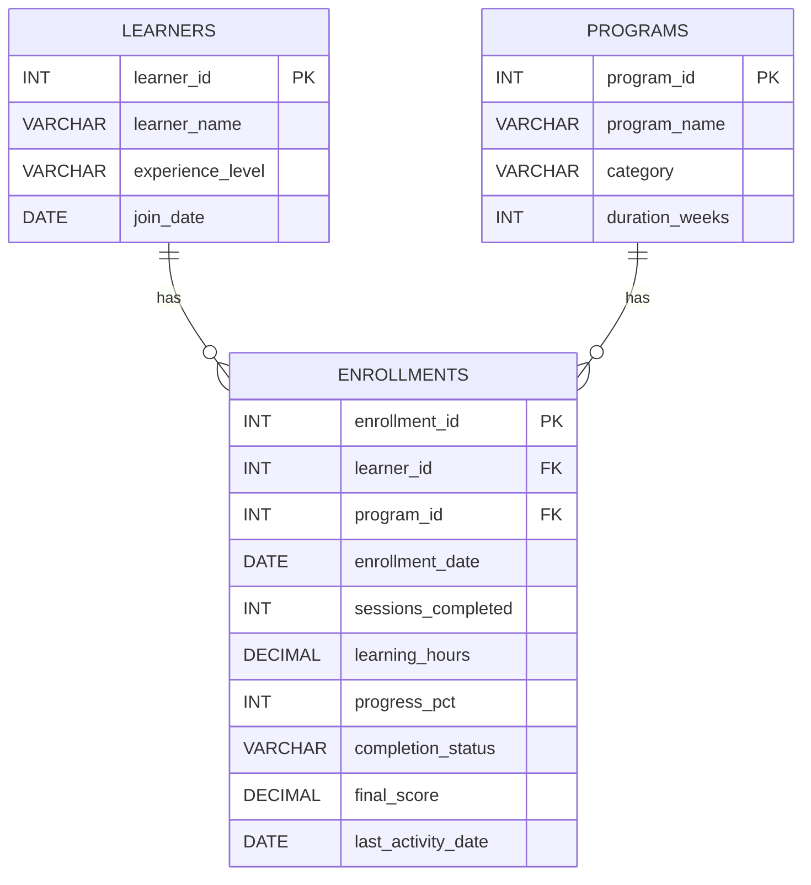
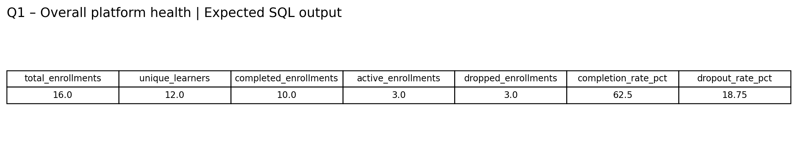
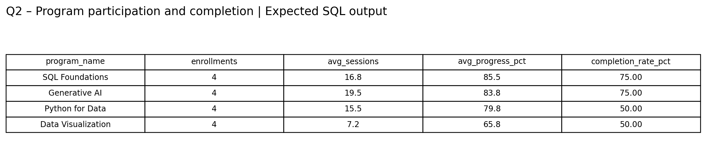
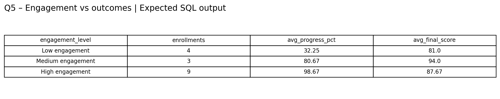
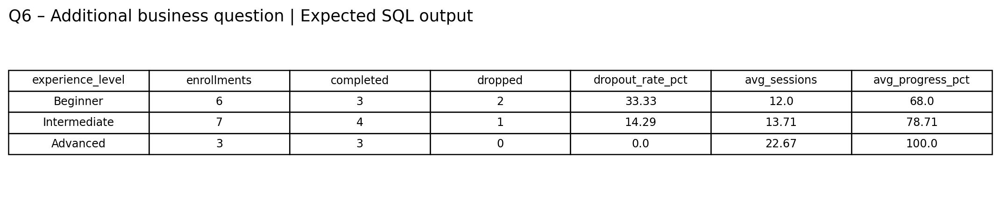

# LearnAI – SQL Business Analysis

## 1. Project Overview

**LearnAI** is an AI-powered learning platform designed to help professionals build new skills.

The platform is getting more learners, but the team wants to understand whether that growth is translating into meaningful learning outcomes. Some learners stay active and progress, while others lose interest. Programs also show different participation and completion patterns.

This project uses **SQL and a dummy dataset** to investigate learner behaviour, program performance, engagement, completion and learning outcomes.

> **Important:** The dataset is synthetic and created for this graded project. The findings below demonstrate the analysis approach; they are not claims about real LearnAI users.

---

## 2. Problem Statement

The analysis asks:

1. What is the overall learner situation on the platform?
2. How do learning programs differ in participation and completion?
3. Which learners show possible signs of weak engagement?
4. Does higher participation correspond to better learning outcomes?
5. What additional business question should LearnAI explore based on the findings?

### Additional business question

**Are beginners dropping out more often than experienced learners, and should onboarding/support be different by experience level?**

---

## 3. Dataset Design

The project contains **3 related tables**:

- `learners` – learner information.
- `programs` – learning program information.
- `enrollments` – the main analytical table connecting learners and programs and storing engagement/outcome measures.

### `learners`

| Column | Type | Key | Purpose |
|---|---|---|---|
| learner_id | INT | PK | Unique learner |
| learner_name | VARCHAR(50) | | Learner name |
| experience_level | VARCHAR(20) | | Beginner / Intermediate / Advanced |
| join_date | DATE | | Date learner joined |

### `programs`

| Column | Type | Key | Purpose |
|---|---|---|---|
| program_id | INT | PK | Unique program |
| program_name | VARCHAR(50) | | Program name |
| category | VARCHAR(30) | | Program category |
| duration_weeks | INT | | Program duration |

### `enrollments`

| Column | Type | Key | Purpose |
|---|---|---|---|
| enrollment_id | INT | PK | Unique enrollment |
| learner_id | INT | FK | Links to `learners` |
| program_id | INT | FK | Links to `programs` |
| enrollment_date | DATE | | Program enrollment date |
| sessions_completed | INT | | Completed learning sessions |
| learning_hours | DECIMAL(5,1) | | Learning time |
| progress_pct | INT | | Progress percentage |
| completion_status | VARCHAR(15) | | Completed / Active / Dropped |
| final_score | DECIMAL(5,2) | | Final assessment score |
| last_activity_date | DATE | | Latest recorded activity |

### Why these tables?

I separated **learner**, **program**, and **enrollment** information because one learner can join multiple programs and one program can have multiple learners. The `enrollments` table therefore works as the bridge table.

---

## 4. Entity Relationship Diagram



### Relationship explanation

- One learner can have multiple enrollments.
- One program can have multiple enrollments.
- `enrollments` acts as the bridge between learners and programs.
- Engagement and outcome measures are stored in `enrollments` because they relate to a learner's participation in a particular program.

---

## 5. Analysis Approach

I used a **business-question-first approach**.

**Overall platform → Program comparison → Weak engagement → Outcomes → Engagement vs outcomes → Experience level → Deeper analysis**

The idea was not to use SQL functions just for demonstration. Each query answers a business question.

---

## 6. Query Plan

| Query | Business question | Main SQL concepts | Why I chose it |
|---|---|---|---|
| Q1 | What is the overall platform health? | COUNT, COUNT DISTINCT, conditional aggregation | Establish a baseline |
| Q2 | How do programs differ? | JOIN, GROUP BY, AVG, COUNT | Compare participation and completion |
| Q3 | Who may have weak engagement? | JOIN, WHERE, OR | Identify learners needing attention |
| Q4 | Do programs differ in outcomes? | JOIN, GROUP BY, AVG | Look beyond completion |
| Q5 | Does more participation mean better outcomes? | CASE, GROUP BY, AVG | Compare engagement with progress and score |
| Q6 | Do experience levels show different dropout patterns? | JOIN, GROUP BY, conditional aggregation | Explore the additional question |
| Q7 | Are there highly engaged but lower-scoring learners? | Subquery, JOIN | Find exceptions hidden by averages |
| Q8 | How can programs be compared by completion rate? | CTE, DENSE_RANK | Create a structured program comparison |

---

## 7. Key Results

### Q1 – Overall platform health

.
The dummy dataset contains:

- **16 enrollments**
- **12 unique learners**
- **10 completed**
- **3 active**
- **3 dropped**
- **62.50% completion rate**
- **18.75% dropout rate**

This gives a baseline for the rest of the analysis.

### Q2 – Program comparison



The synthetic data shows differences between programs. SQL Foundations and Generative AI have a **75% completion rate**, while Python for Data and Data Visualization have **50%**.

This tells LearnAI that program-level participation and completion are not identical across programs and may deserve further investigation.

### Q3 – Weak engagement

The project uses a simple demonstration rule:

- fewer than **7 sessions**, OR
- progress below **50%**

This identifies learners who may need further attention.

> These thresholds are only for the dummy dataset. In a real platform, they should be validated using historical learner behaviour.

### Q4 – Learning outcomes

This query compares average learning hours, progress and final score by program.

The purpose is important because **completion alone does not fully describe learning outcome**.

### Q5 – Engagement vs outcome



The dummy data shows a clear pattern between engagement and progress:

- Low engagement → **32.3% average progress**
- Medium engagement → **80.7% average progress**
- High engagement → **98.7% average progress**

However, final score is not perfectly increasing with engagement in this synthetic dataset. Medium engagement has an average score of **94.0**, while high engagement has **87.67**.

So the important observation is:

> **Higher participation is strongly associated with higher progress in this dataset, but higher participation does not automatically mean a higher final score.**

This is a pattern in the dummy data, not proof of causation.

### Q6 – Additional business question



The dummy data shows:

- Beginner: **16.67% dropout rate**
- Intermediate: **14.29% dropout rate**
- Advanced: **0% dropout rate**

Beginners therefore show the highest dropout rate in this synthetic dataset.

The business follow-up should not be to assume that experience level causes dropout. Instead, LearnAI could investigate whether **onboarding, early guidance, course difficulty, or engagement support** differs across experience groups.

### Q7 – High engagement but lower outcome

This query looks for learners with at least 15 sessions whose final score is below the overall average final score.

This is useful because averages can hide individual exceptions. It can help LearnAI identify learners who are active but may still need academic support.

### Q8 – Program ranking

The query uses a CTE and `DENSE_RANK()` to compare programs by completion rate.

Expected result:

| Program | Completion rate | Rank |
|---|---:|---:|
| Generative AI | 75% | 1 |
| SQL Foundations | 75% | 1 |
| Data Visualization | 50% | 2 |
| Python for Data | 50% | 2 |

The tied ranks are intentional because the completion rates are equal.

---

## 8. Overall Conclusion

The SQL analysis provides four main observations from the **dummy dataset**:

1. LearnAI has a mixed learner status: some enrollments are completed, while others are active or dropped.
2. Program participation and completion vary across programs.
3. Higher engagement is associated with much higher progress in the synthetic data, but it does not automatically produce the highest final score.
4. Beginners have the highest dropout rate in this dataset, which supports the additional question about onboarding and learner support.

### Business interpretation

The next step should be to investigate **why** learners disengage or drop out rather than looking only at completion percentages.

Possible areas for deeper investigation include:

- early onboarding experience,
- program difficulty,
- learner activity during the first few weeks,
- support/intervention received,
- and whether the program content matches learner experience level.

---

## 9. Important Assumptions and Limitations

- This is a **small synthetic dataset** created for demonstration.
- The 7-session and 50% progress thresholds are demonstration thresholds.
- `final_score` is NULL for incomplete enrollments.
- Averages use available final scores.
- The analysis shows associations/patterns; it does not prove causation.
- The findings should not be treated as production conclusions.

---

## 10. Tools Used

- MySQL
- MySQL Workbench
- SQL
- GitHub

---

## 11. Project Files

```text
LearnAI-SQL-Analysis/
├── README.md
├── LearnAI_Dummy_Dataset.sql
├── LearnAI_SQL_Analysis.sql
└── screenshots/
    ├── 01_database_structure.png
    ├── 01_overall_platform_health.png
    ├── 02_program_analysis.png
    ├── 03_engagement_vs_outcome.png
    └── 04_additional_business_question.png
```

### How to run

1. Open MySQL Workbench.
2. Run `LearnAI_Dummy_Dataset.sql`.
3. Run `LearnAI_SQL_Analysis.sql`.
4. Execute the queries one by one.
5. Compare the results with the output images in `screenshots/`.

> For the final review, it is even better to run the queries yourself and capture the actual MySQL Workbench result grids.

---

## 12. Demo Flow

**Problem → Data model → ER diagram → Query purpose → SQL execution → Output → Business insight → Additional question**

---

## Author

**Ullas Y R**
