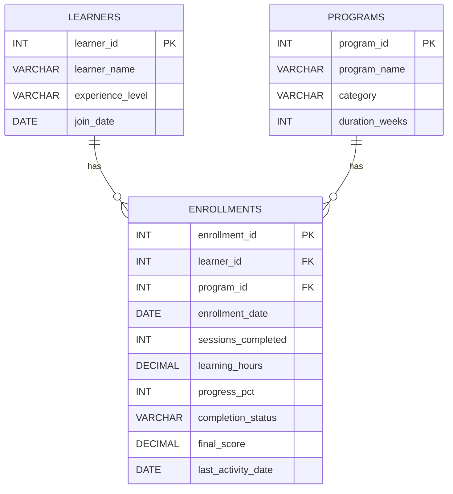

# LearnAI – SQL Business Analysis

## 1. Project Overview

**LearnAI** is an AI-powered learning platform designed to help professionals build new skills.

The number of learners joining the platform is increasing, but LearnAI is not sure whether this growth is translating into meaningful learning outcomes. Some learners remain active and make steady progress, while others lose interest. Different programs also show different levels of participation and completion.

This project uses **SQL and a dummy dataset** to investigate learner behaviour, program performance, engagement, completion and learning outcomes.

## 2. Business Problem

The analysis focuses on:

1. Are learners actually engaging?
2. Are all programs performing similarly?
3. What indicates weak engagement?
4. Does more participation actually mean better outcomes?

5. **Additional Business Question: Are beginners dropping out more often than experienced learners, and should onboarding/support be different by experience level?**

## 3. Dataset Design

The project uses three related tables.

### `learners`

| Attribute | Data Type | Key | Description |
|---|---|---|---|
| `learner_id` | INT | PK | Unique learner ID |
| `learner_name` | VARCHAR(50) | | Learner name |
| `experience_level` | VARCHAR(20) | | Beginner, Intermediate or Advanced |
| `join_date` | DATE | | Date the learner joined LearnAI |

### `programs`

| Attribute | Data Type | Key | Description |
|---|---|---|---|
| `program_id` | INT | PK | Unique program ID |
| `program_name` | VARCHAR(50) | | Name of the learning program |
| `category` | VARCHAR(30) | | Program category |
| `duration_weeks` | INT | | Expected program duration |

### `enrollments`

This is the main analytical table. It connects learners and programs and stores engagement and outcome measures.

| Attribute | Data Type | Key | Description |
|---|---|---|---|
| `enrollment_id` | INT | PK | Unique enrollment ID |
| `learner_id` | INT | FK | References `learners.learner_id` |
| `program_id` | INT | FK | References `programs.program_id` |
| `enrollment_date` | DATE | | Date of program enrollment |
| `sessions_completed` | INT | | Number of completed learning sessions |
| `learning_hours` | DECIMAL(5,1) | | Total learning time |
| `progress_pct` | INT | | Program progress percentage |
| `completion_status` | VARCHAR(15) | | Completed, Active or Dropped |
| `final_score` | DECIMAL(5,2) | | Final assessment score; NULL if not completed |
| `last_activity_date` | DATE | | Most recent recorded learning activity |

## 4. Entity Relationship Diagram

### Relationship explanation

- One learner can have multiple enrollments.
- One program can have multiple enrollments.
- `enrollments` acts as the bridge between learners and programs.
- Engagement and outcome measures are stored in `enrollments` because they relate to a learner's participation in a particular program.

## 5. Analysis Approach

I followed a **business-question-first approach** rather than starting with SQL functions.

**Step 1 – Overall platform:** measure total enrollments, unique learners, completed, active and dropped learners.

**Step 2 – Program comparison:** compare sessions, progress and completion across programs.

**Step 3 – Weak engagement:** identify learners with low sessions or low progress for further investigation.

**Step 4 – Engagement vs outcome:** group learners by engagement level and compare progress and final scores.

**Step 5 – Additional question:** compare dropout behaviour across Beginner, Intermediate and Advanced learners.

**Step 6 – Deeper analysis:** use a subquery to find highly engaged learners with lower-than-average outcomes and a CTE/window function to rank programs by completion rate.

**Analysis flow:** Overall Platform → Program Comparison → Weak Engagement → Engagement vs Outcome → Experience Level → Deeper Analysis

## 6. SQL Query Plan

| Query | Business Question | Level | Main SQL Concepts | Business Purpose |
|---|---|---|---|---|
| Q1 | What is the overall platform health? | Simple | COUNT, COUNT DISTINCT, conditional aggregation | Establish a platform baseline |
| Q2 | How do programs differ in participation and completion? | Intermediate | JOIN, GROUP BY, AVG, COUNT | Identify program-level differences |
| Q3 | Which learners show possible weak engagement? | Simple | JOIN, WHERE, OR | Identify learners who may need attention |
| Q4 | Do programs differ in learning outcomes? | Intermediate | JOIN, GROUP BY, AVG, NULL handling | Separate activity/completion from outcomes |
| Q5 | Does higher participation correspond to better outcomes? | Intermediate | CASE, GROUP BY, AVG | Compare engagement with progress and scores |
| Q6 | Do experience levels show different dropout patterns? | Intermediate | JOIN, GROUP BY, conditional aggregation | Explore the additional business question |
| Q7 | Are highly engaged learners also achieving higher outcomes? | Advanced | Subquery, JOIN, aggregate comparison | Find individual exceptions hidden by averages |
| Q8 | How can programs be ranked by completion rate? | Advanced | CTE, DENSE_RANK window function | Provide a structured program comparison |

### Why these eight queries?

The queries were selected based on the business problem rather than simply trying to demonstrate many SQL functions. Each query answers a specific business question and adds a different level of analysis.

## 7. Key Analytical Idea

Participation should not automatically be treated as learning success.

The analysis considers:

**Engagement → Progress → Completion → Learning Outcome**

Sessions and learning hours indicate activity, while progress, completion status and final score provide additional information about outcomes.

> **Association should not be treated as causation.** If higher engagement and better outcomes appear together, the analysis shows a pattern in the dataset; it does not prove that engagement caused the outcome.

## 8. ⭐ Additional Business Question

> **Are beginners dropping out more often than experienced learners, and should onboarding/support be different by experience level?**

This question is based on `experience_level`, `completion_status`, `sessions_completed` and `progress_pct`.

If a difference appears in the dummy analysis, the next step is to investigate the underlying reason rather than assuming experience level itself is the cause.

## 9. Important Assumptions and Limitations

- The dataset is intentionally small and created for demonstration.
- The **7-session** and **50% progress** thresholds in Q3 are demonstration thresholds.
- In a real business scenario, thresholds should be validated using historical learner behaviour.
- `final_score` is NULL for incomplete enrollments, so average score calculations use available completed scores.
- Results are examples of SQL-driven analysis, not production business conclusions.
- A difference between groups does not by itself explain the reason for that difference.

## 10. SQL Concepts Demonstrated

SELECT, WHERE, ORDER BY, GROUP BY, COUNT, COUNT DISTINCT, AVG, CASE, INNER JOIN, conditional aggregation, NULL handling, subquery, CTE, `DENSE_RANK()` and KPI calculations.

## 11. Tools Used

- MySQL
- MySQL Workbench
- SQL
- GitHub

## 12. Project Files

### File descriptions

**`LearnAI_Dummy_Dataset.sql`**
- Creates the `learnai` database.
- Creates all three tables.
- Creates primary/foreign-key relationships.
- Inserts the dummy records.

**`LearnAI_SQL_Analysis.sql`**
- Contains the eight business-analysis queries.
- Progresses from simple to advanced SQL concepts.

**`README.md`**
- Documents the business problem, schema, attributes, ER diagram, analysis approach, query purposes and additional business question.

## 13. Author

**Ullas Y R**
